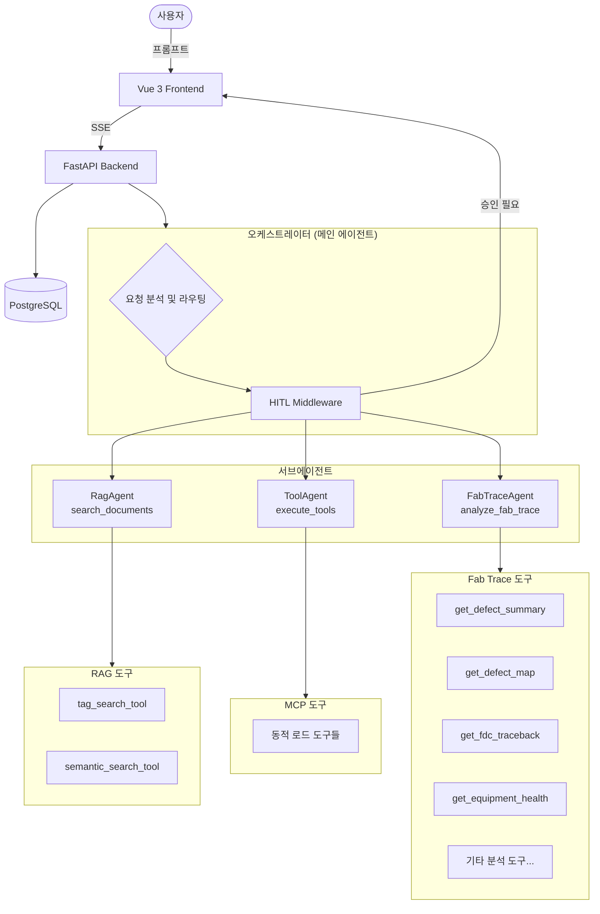

# AI Chatbot Platform

LangGraph 기반 2-Level ReAct 에이전트 아키텍처를 활용한 AI 챗봇 플랫폼입니다.
오케스트레이터가 사용자 요청을 분석하여 전문 서브에이전트(RAG, Tool, FabTrace)에게 자동으로 위임하고, 실시간 SSE 스트리밍으로 진행 상황을 전달합니다.

---

## 주요 기능

- **2-Level ReAct 에이전트** -- 오케스트레이터가 서브에이전트를 도구로 사용하는 계층적 구조
- **멀티 LLM 프로바이더** -- OpenAI, Google Gemini, OCI 등 다양한 모델 지원
- **Human-in-the-Loop (HITL)** -- 도구 실행 전 사용자 승인/거부 워크플로우
- **실시간 SSE 스트리밍** -- 에이전트 진행 상황 및 서브에이전트 도구 호출 상태 실시간 전달
- **RAG (검색 증강 생성)** -- 태그 기반 + 시맨틱 검색으로 문서 활용
- **MCP (Model Context Protocol)** -- 외부 도구를 동적으로 로드하여 확장
- **Fab Trace 분석** -- 반도체/디스플레이 설비 트레이스 데이터 분석 및 불량 원인 추적
- **OpenTelemetry 분산 추적** -- 요청 흐름 전체를 추적하는 관측성 지원

---

## 아키텍처



### 에이전트 흐름

```
사용자 요청
  --> 오케스트레이터 (메인 에이전트)
    --> 요청 분석 및 라우팅
      --> [문서 질문]   RagAgent     (tag_search, semantic_search)
      --> [도구 필요]   ToolAgent    (MCP 도구)
      --> [팹 분석]     FabTraceAgent (8개 분석 도구)
      --> [일반 대화]   직접 응답
    --> HITL 승인 대기 (선택적)
  --> 최종 응답 스트리밍
```

---

## 기술 스택

### Backend

| 기술 | 버전 | 용도 |
|------|------|------|
| Python | 3.11+ | 런타임 |
| FastAPI | 0.124+ | REST API 서버 |
| LangChain | latest | LLM 프레임워크 |
| LangGraph | latest | 에이전트 그래프 |
| SQLAlchemy | 2.0+ | 비동기 ORM |
| PostgreSQL | 17 | 데이터베이스 |
| Pydantic | 2.12+ | 데이터 검증 |
| uvicorn | 0.38+ | ASGI 서버 |

### Frontend

| 기술 | 버전 | 용도 |
|------|------|------|
| Vue | 3.5+ | UI 프레임워크 |
| Vite | 6.0+ | 빌드 도구 |
| Pinia | 2.2+ | 상태 관리 |
| TypeScript | 5.6+ | 타입 시스템 |
| markdown-it | 14.1+ | 마크다운 렌더링 |
| highlight.js | 11.9+ | 코드 하이라이팅 |

---

## 빠른 시작

### 사전 요구사항

- Python 3.11+
- Node.js 18+
- PostgreSQL 17 (또는 Docker)

### 1. 데이터베이스

```bash
cd chat-backend
docker compose up -d
```

### 2. 백엔드

```bash
cd chat-backend

# 가상환경 생성 및 활성화
python -m venv .venv
source .venv/bin/activate  # Windows: .venv\Scripts\activate

# 의존성 설치
pip install -r requirements.txt

# 환경변수 설정
cp .env.example .env
# .env 파일에 LLM API 키 등 설정

# DB 초기화
python init_db.py

# 서버 실행
uvicorn main:app --reload --port 8000
```

### 3. 프론트엔드

```bash
cd chat-frontend-vue

# 의존성 설치
npm install

# 환경변수 설정
cp .env.example .env

# 개발 서버 실행
npm run dev
```

서버 실행 후 `http://localhost:5173`에서 접속 가능합니다.

---

## 프로젝트 구조

```
chatbot/
├── README.md
├── chat-backend/
│   ├── main.py                      # FastAPI 진입점
│   ├── requirements.txt
│   ├── docker-compose.yml           # PostgreSQL
│   ├── ai/
│   │   ├── agents/                  # 서브에이전트 정의
│   │   │   ├── base.py              # BaseAgent 추상 클래스
│   │   │   ├── rag_agent.py         # RAG 검색 에이전트
│   │   │   ├── tool_agent.py        # MCP 도구 에이전트
│   │   │   ├── fab_trace_agent.py   # 팹 설비 분석 에이전트
│   │   │   └── middleware.py        # SubProgressMiddleware
│   │   ├── graph/
│   │   │   ├── orchestrator.py      # 오케스트레이터 (메인 에이전트)
│   │   │   ├── progress.py          # contextvars 기반 진행 큐
│   │   │   ├── nodes/               # 그래프 노드
│   │   │   └── schema/              # 상태 및 스트림 타입
│   │   └── tools/                   # 도구 구현체
│   ├── router/                      # API 라우터
│   ├── service/                     # 비즈니스 로직
│   ├── config/                      # 설정 (AI, CORS, 텔레메트리)
│   ├── db/                          # 데이터베이스 레이어
│   ├── mcp_hub/                     # MCP 레지스트리
│   └── docs/                        # 문서
└── chat-frontend-vue/
    ├── package.json
    └── src/
        ├── components/              # Vue 컴포넌트
        ├── pages/                   # 페이지 (ChatPage, WelcomePage)
        ├── stores/chatStore.ts      # Pinia 상태 관리
        ├── services/chatService.ts  # API 통신
        └── types/chat.ts            # 타입 정의
```

---

## 문서

| 문서 | 설명 |
|------|------|
| [설치 가이드](chat-backend/docs/installation.md) | 상세 설치 및 환경 설정 방법 |
| [API 레퍼런스](chat-backend/docs/api-reference.md) | REST API 엔드포인트 명세 |
| [에이전트 아키텍처](chat-backend/docs/agent-architecture.md) | 2-Level ReAct 에이전트 구조 상세 |

---

## 라이선스

이 프로젝트는 [MIT License](LICENSE)를 따릅니다.
