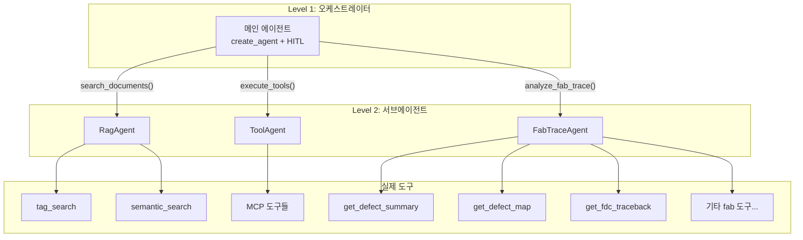
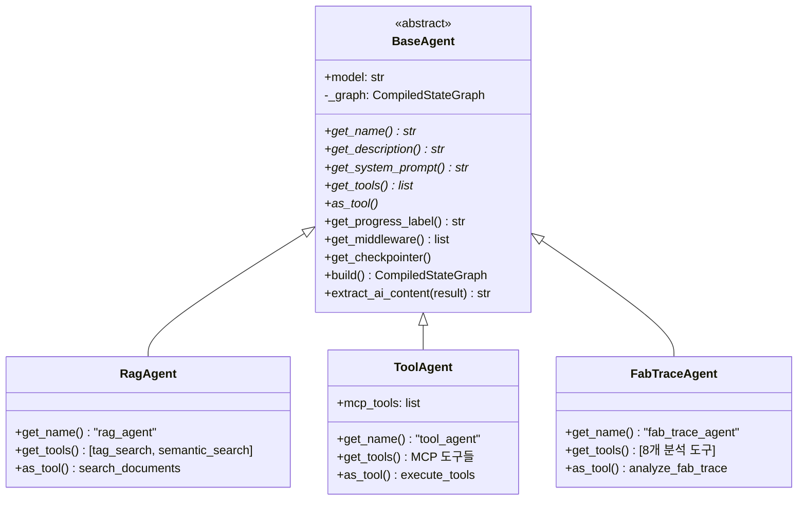
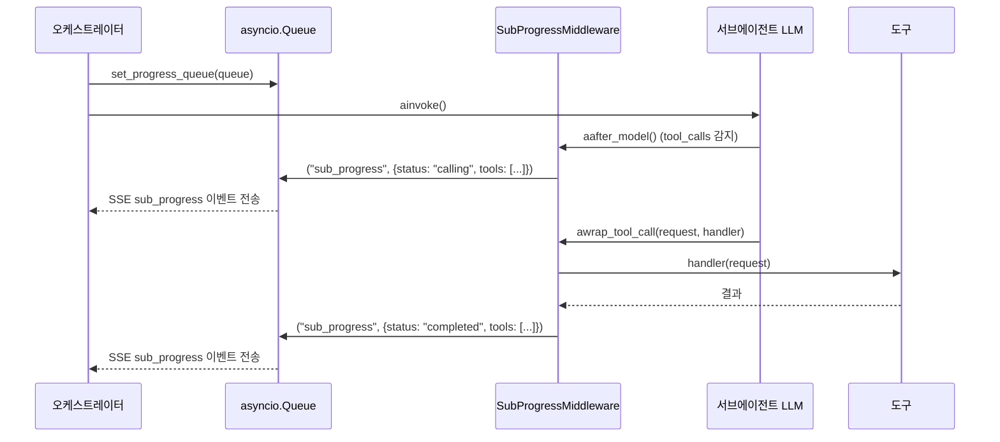
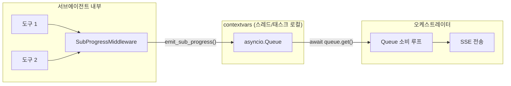
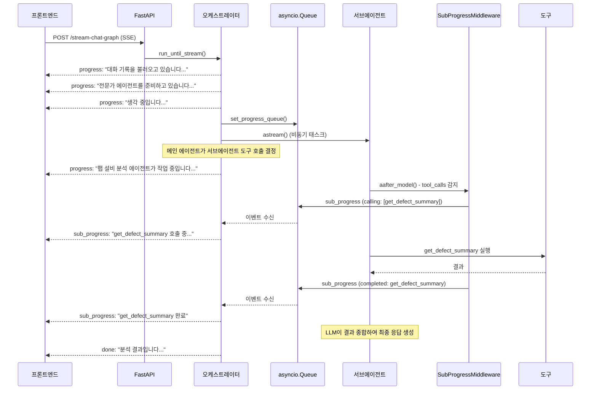

# 에이전트 아키텍처

AI Chatbot Platform의 2-Level ReAct 에이전트 아키텍처를 상세히 설명합니다.

---

## 목차

- [개요](#개요)
- [오케스트레이터](#오케스트레이터)
- [BaseAgent 인터페이스](#baseagent-인터페이스)
- [기본 제공 서브에이전트](#기본-제공-서브에이전트)
- [새로운 서브에이전트 만들기](#새로운-서브에이전트-만들기)
- [SubProgressMiddleware](#subprogressmiddleware)
- [HITL Middleware](#hitl-middleware)
- [실시간 진행 전달 구조](#실시간-진행-전달-구조)

---

## 개요

본 시스템은 **2-Level ReAct** (Reasoning + Acting) 패턴을 사용합니다.

- **Level 1 (오케스트레이터)**: 사용자 요청을 분석하고 적절한 서브에이전트에게 위임
- **Level 2 (서브에이전트)**: 각 전문 영역의 도구를 활용하여 실제 작업 수행

서브에이전트는 `as_tool()`을 통해 일반 LangChain 도구로 변환되어 오케스트레이터에 전달됩니다. 오케스트레이터 입장에서 서브에이전트는 단순한 "도구"일 뿐이므로, LangChain의 표준 도구 호출 메커니즘을 그대로 사용합니다.



### 왜 2-Level인가?

| 장점 | 설명 |
|------|------|
| **관심사 분리** | 각 서브에이전트가 자신의 전문 영역에만 집중 |
| **독립적 확장** | 새 서브에이전트 추가 시 오케스트레이터 코드 변경 최소화 |
| **시스템 프롬프트 분리** | 각 서브에이전트가 독자적인 프롬프트와 도구를 보유 |
| **자동 라우팅** | 오케스트레이터 LLM이 요청에 맞는 서브에이전트를 자동 선택 |
| **실시간 진행 추적** | SubProgressMiddleware로 내부 도구 호출 상태를 자동 보고 |

---

## 오케스트레이터

`ai/graph/orchestrator.py`에 정의된 `Orchestrator` 클래스가 전체 에이전트 시스템을 관리합니다.

### 핵심 동작

1. **서브에이전트 수집**: `RagAgent`, `ToolAgent`, `FabTraceAgent` 인스턴스 생성
2. **도구 변환**: 각 서브에이전트의 `as_tool()`을 호출하여 LangChain 도구로 변환
3. **메인 에이전트 생성**: `create_agent()`로 변환된 도구들을 가진 메인 에이전트 구성
4. **HITL 미들웨어 적용**: 특정 도구에 대해 `HumanInTheLoopMiddleware` 설정
5. **스트리밍 실행**: `astream()`으로 에이전트 실행, `asyncio.Queue`를 통해 진행 이벤트 수집

### 모델 문자열 해석

오케스트레이터는 프론트엔드에서 받은 `model` 값을 LangChain 형식의 문자열로 변환합니다.

```python
# 입력: provider="gemini", api_model="gemini-2.0-flash"
# 변환: "google_genai:gemini-2.0-flash"

_LANGCHAIN_PROVIDER_MAP = {
    "gemini": "google_genai",
}
```

### 에이전트 캐싱

동일 모델에 대한 에이전트를 캐싱하여 매 요청마다 재빌드를 방지합니다. TTL은 1시간이며, `invalidate_agent_cache()`로 수동 무효화할 수 있습니다.

```python
# 모듈 레벨 싱글턴
_checkpointer = InMemorySaver()
_agent_cache: dict[str, tuple[object, float]] = {}
_CACHE_TTL = 3600  # 1시간
```

---

## BaseAgent 인터페이스

`ai/agents/base.py`에 정의된 추상 클래스로, 모든 서브에이전트의 기반입니다.

### 추상 메서드 (필수 구현)

| 메서드 | 반환 타입 | 설명 |
|--------|----------|------|
| `get_name()` | `str` | 에이전트 고유 이름 (예: `"rag_agent"`) |
| `get_description()` | `str` | 에이전트 설명 (오케스트레이터 라우팅 참고용) |
| `get_system_prompt()` | `str` | 서브에이전트의 시스템 프롬프트 |
| `get_tools()` | `list` | 서브에이전트가 사용할 도구 목록 |
| `as_tool()` | LangChain `@tool` | 메인 에이전트용 도구로 래핑하여 반환 |

### 오버라이드 가능 메서드

| 메서드 | 기본값 | 설명 |
|--------|--------|------|
| `get_progress_label()` | `"에이전트이름 실행 중..."` | 오케스트레이터에서 표시할 진행 메시지 |
| `get_middleware()` | `[SubProgressMiddleware]` | 미들웨어 목록 (기본: 진행 추적) |
| `get_checkpointer()` | `None` | 체크포인터 (상태 지속성 필요 시) |

### 유틸리티 메서드

| 메서드 | 설명 |
|--------|------|
| `build()` | 서브에이전트 그래프 생성 (캐싱됨) |
| `extract_ai_content(result)` | 에이전트 실행 결과에서 마지막 AI 응답 추출 |
| `_content_to_str(content)` | content가 list일 경우 텍스트만 추출하여 str 변환 |

### 클래스 다이어그램



---

## 기본 제공 서브에이전트

### RagAgent

문서 검색 전문 에이전트입니다. 태그 기반 검색과 시맨틱 검색을 조합하여 관련 문서를 찾습니다.

| 항목 | 값 |
|------|------|
| 이름 | `rag_agent` |
| 도구 이름 (오케스트레이터용) | `search_documents` |
| 내부 도구 | `tag_search_tool`, `semantic_search_tool` |
| HITL | 활성 |

### ToolAgent

MCP 프로토콜을 통해 동적으로 로드된 외부 도구를 실행하는 에이전트입니다.

| 항목 | 값 |
|------|------|
| 이름 | `tool_agent` |
| 도구 이름 (오케스트레이터용) | `execute_tools` |
| 내부 도구 | MCP 서버에서 동적 로드 |
| HITL | 비활성 |

> MCP 도구가 없으면 ToolAgent는 생성되지 않습니다.

### FabTraceAgent

반도체/디스플레이 팹 설비 트레이스 데이터를 분석하는 전문 에이전트입니다.

| 항목 | 값 |
|------|------|
| 이름 | `fab_trace_agent` |
| 도구 이름 (오케스트레이터용) | `analyze_fab_trace` |
| 내부 도구 | 8개 (아래 참조) |
| HITL | 활성 |

**내부 도구:**

| 도구 | 분석 단계 | 설명 |
|------|----------|------|
| `get_defect_summary` | 1단계 | 불량 현황 요약 |
| `get_defect_map` | 2단계 | 불량 공간 패턴 분석 |
| `get_defects` | 2단계 | 불량 집중 LOT 식별 |
| `get_fdc_traceback` | 3단계 | 의심 설비 역추적 |
| `get_equipment_health` | 4단계 | 설비 상태 확인 |
| `get_trace_summary` | 4단계 | 파라미터 통계/OOS율 |
| `get_param_drift` | 4단계 | 시간별 편차 추이 |
| `get_trace_compare` | 4단계 | 동일 타입 설비 간 비교 |

FabTraceAgent는 병렬 호출을 적극 활용합니다. 2단계의 `get_defect_map`과 `get_defects`, 4단계의 4개 도구는 각각 동시 호출됩니다.

---

## 새로운 서브에이전트 만들기

새로운 서브에이전트를 추가하는 방법을 단계별로 설명합니다.

### 1단계: 도구 구현

먼저 서브에이전트가 사용할 도구를 구현합니다.

```python
# ai/tools/my_tools.py
from langchain_core.tools import tool

@tool
def my_lookup_tool(query: str) -> str:
    """특정 데이터를 조회합니다.

    Args:
        query: 조회할 검색어
    """
    # 실제 구현
    result = do_lookup(query)
    return result

@tool
def my_process_tool(data: str) -> str:
    """데이터를 처리합니다.

    Args:
        data: 처리할 데이터
    """
    result = process(data)
    return result

def get_my_tools() -> list:
    """이 에이전트의 도구 목록을 반환합니다."""
    return [my_lookup_tool, my_process_tool]
```

### 2단계: 서브에이전트 클래스 작성

`BaseAgent`를 상속하여 서브에이전트를 정의합니다.

```python
# ai/agents/my_agent.py
import logging
from langchain_core.messages import HumanMessage
from langchain_core.tools import tool

from ai.agents.base import BaseAgent
from ai.tools.my_tools import get_my_tools

logger = logging.getLogger("chat-server")

MY_AGENT_PROMPT = """당신은 XX 전문가입니다.
사용자의 요청에 따라 적절한 도구를 사용하여 작업을 수행합니다.

사용 가능한 도구:
- my_lookup_tool: 데이터 조회
- my_process_tool: 데이터 처리

한국어로 응답하세요.
"""


class MyAgent(BaseAgent):

    def __init__(self, model: str):
        super().__init__(model)

    def get_name(self) -> str:
        return "my_agent"

    def get_description(self) -> str:
        return "XX 관련 작업을 수행하는 전문 에이전트입니다"

    def get_progress_label(self) -> str:
        return "🔧 MyAgent가 작업 중입니다..."

    def get_system_prompt(self) -> str:
        return MY_AGENT_PROMPT

    def get_tools(self) -> list:
        return get_my_tools()

    def as_tool(self):
        """서브에이전트를 오케스트레이터용 도구로 래핑"""
        agent = self.build()

        @tool
        async def my_task(request: str) -> str:
            """XX 관련 작업을 수행합니다.

            Args:
                request: 작업 요청 설명
            """
            logger.info(f"🔧 MyAgent 호출: {request[:50]}")
            result = await agent.ainvoke({
                "messages": [HumanMessage(content=request)]
            })
            return self.extract_ai_content(result)

        return my_task
```

### 3단계: 오케스트레이터에 등록

`ai/graph/orchestrator.py`의 `_build_main_agent` 메서드에 서브에이전트를 추가합니다.

```python
# ai/graph/orchestrator.py 내부

from ai.agents import RagAgent, ToolAgent, FabTraceAgent
from ai.agents.my_agent import MyAgent  # 추가

async def _build_main_agent(self, model_string: str):
    # ...기존 서브에이전트...

    my_agent = MyAgent(model=model_string)
    sub_agents.append(my_agent)

    # 나머지 코드는 자동으로 처리됨
    # (as_tool() 호출, 진행 라벨 수집 등)
```

### 4단계: 오케스트레이터 프롬프트 업데이트

`MAIN_AGENT_PROMPT`에 새 에이전트의 용도를 추가합니다.

```python
MAIN_AGENT_PROMPT = """...
사용 가능한 전문가:
- search_documents: 문서 검색
- execute_tools: 외부 도구 실행
- analyze_fab_trace: 팹 설비 분석
- my_task: XX 관련 작업          ← 추가

판단 기준:
...
5. XX 관련 요청 → my_task 호출   ← 추가
...
"""
```

### 5단계: HITL 설정 (선택)

새 에이전트에 HITL을 적용하려면 `HumanInTheLoopMiddleware`의 `interrupt_on`에 도구 이름을 추가합니다.

```python
HumanInTheLoopMiddleware(
    interrupt_on={
        "search_documents": True,
        "analyze_fab_trace": True,
        "my_task": True,  # 추가
    },
    description_prefix="도구 실행 승인 필요",
)
```

### 체크리스트

새 서브에이전트 추가 시 확인 사항:

- [ ] `BaseAgent`의 5개 추상 메서드 모두 구현
- [ ] `as_tool()` 반환 함수의 docstring이 오케스트레이터 라우팅에 충분한 정보를 제공
- [ ] `__init__.py`에 import 추가 (필요시)
- [ ] 오케스트레이터 프롬프트에 용도 설명 추가
- [ ] HITL 필요 시 `interrupt_on`에 등록

---

## SubProgressMiddleware

`ai/agents/middleware.py`에 정의된 미들웨어로, 서브에이전트 내부 도구 호출 상태를 오케스트레이터에 자동 보고합니다.

### 동작 원리



### 이벤트 종류

| 이벤트 | 발생 시점 | 정보 |
|--------|----------|------|
| `calling` | LLM이 tool_calls를 포함한 응답 반환 시 | 호출할 도구 이름 목록, 병렬 여부 |
| `completed` | 개별 도구 실행 완료 시 | 완료된 도구 이름 |
| `failed` | 개별 도구 실행 실패 시 | 실패한 도구 이름 |

### 병렬 호출 감지

LLM이 한 번의 응답에서 여러 도구를 동시에 호출하면 `aafter_model()`에서 모든 도구 이름을 함께 보고합니다. `parallel` 필드는 도구가 2개 이상일 때 `true`가 됩니다.

```python
# LLM 응답에 tool_calls가 2개 이상이면 병렬
names = [tc["name"] for tc in last_msg.tool_calls]
await emit_sub_progress(self.agent_name, names, "calling")
# -> {"tools": ["get_defect_map", "get_defects"], "parallel": true}
```

### 비동기/동기 모두 지원

| 메서드 | 용도 |
|--------|------|
| `aafter_model()` / `awrap_tool_call()` | `ainvoke()` / `astream()` 에서 사용 |
| `after_model()` / `wrap_tool_call()` | `invoke()` / `stream()` 에서 사용 |

`BaseAgent.get_middleware()`가 기본적으로 `SubProgressMiddleware`를 포함하므로, `BaseAgent`를 상속한 모든 서브에이전트는 별도 설정 없이 자동으로 진행 추적이 활성화됩니다.

---

## HITL Middleware

LangChain의 `HumanInTheLoopMiddleware`를 사용하여 특정 도구 실행 전 사용자 승인을 요구합니다.

### 설정

```python
from langchain.agents.middleware import HumanInTheLoopMiddleware

HumanInTheLoopMiddleware(
    interrupt_on={
        "search_documents": True,
        "analyze_fab_trace": True,
    },
    description_prefix="도구 실행 승인 필요",
)
```

### Interrupt 처리 흐름

1. 메인 에이전트가 HITL 대상 도구를 호출하려 하면 `__interrupt__` 이벤트 발생
2. 오케스트레이터가 interrupt에서 `tool_name`과 `tool_args` 추출
3. `confirm` SSE 이벤트를 프론트엔드에 전송
4. `thread_id`를 `_interrupted_tools`에 저장하고 스트림 종료
5. 사용자 결정 후 `/chat/resume`으로 재개 요청
6. `Command(resume={"decisions": [{"type": "approve"}]})` 또는 `{"type": "reject"}`로 그래프 재개

### 체크포인터

HITL은 `InMemorySaver` 체크포인터를 통해 그래프 상태를 `thread_id`별로 보관합니다. Resume 시 동일 `thread_id`로 중단 지점부터 재개합니다.

```python
_checkpointer = InMemorySaver()  # 모듈 싱글턴
```

> **주의**: `InMemorySaver`는 서버 재시작 시 상태가 유실됩니다. 프로덕션 환경에서는 영속적 체크포인터(Redis, PostgreSQL 등) 사용을 고려하세요.

---

## 실시간 진행 전달 구조

오케스트레이터에서 프론트엔드까지 실시간 진행 상황을 전달하는 전체 구조를 설명합니다.

### 핵심 메커니즘: contextvars + asyncio.Queue

서브에이전트 내부에서 발생하는 이벤트를 오케스트레이터에 전달하기 위해 `contextvars`로 관리되는 `asyncio.Queue`를 사용합니다.



### 코드 흐름

#### 1. Queue 설정 (오케스트레이터)

```python
# ai/graph/orchestrator.py - _stream_with_progress()
merged_queue: asyncio.Queue = asyncio.Queue()
set_progress_queue(merged_queue)  # contextvars에 저장
```

#### 2. 이벤트 발행 (미들웨어)

```python
# ai/graph/progress.py
_progress_queue: ContextVar[asyncio.Queue | None] = ContextVar(
    "_progress_queue", default=None
)

async def emit_sub_progress(agent_name, tool_names, status):
    queue = get_progress_queue()  # contextvars에서 조회
    if queue is not None:
        await queue.put((
            "sub_progress",
            {
                "agent_name": agent_name,
                "tools": tool_names,
                "status": status,
                "parallel": len(tool_names) > 1,
            },
        ))
```

#### 3. 이벤트 소비 (오케스트레이터)

```python
# ai/graph/orchestrator.py - _stream_with_progress()
while True:
    event_type, data = await merged_queue.get()

    if event_type == "done":
        break
    elif event_type == "sub_progress":
        # SSE sub_progress 이벤트로 변환하여 yield
        yield (SSEFormatter.format(sub_response), None)
    elif event_type == "chunk":
        # 일반 에이전트 스트리밍 청크 처리
        ...
```

### 전체 SSE 스트리밍 흐름



### contextvars를 사용하는 이유

| 특성 | 설명 |
|------|------|
| **태스크 격리** | 동시에 여러 요청이 처리되어도 각 요청의 Queue가 독립적 |
| **자동 전파** | `asyncio.create_task()`로 생성된 하위 태스크에 자동 전파 |
| **명시적 전달 불필요** | 서브에이전트/미들웨어에 Queue를 직접 전달하지 않아도 됨 |
| **안전한 해제** | `set_progress_queue(None)`으로 Queue 연결 해제 시 이벤트 무시 |

이 패턴으로 서브에이전트 코드는 Queue의 존재를 알 필요 없이, `SubProgressMiddleware`가 자동으로 이벤트를 발행합니다. 오케스트레이터만 Queue를 설정/해제하면 됩니다.
