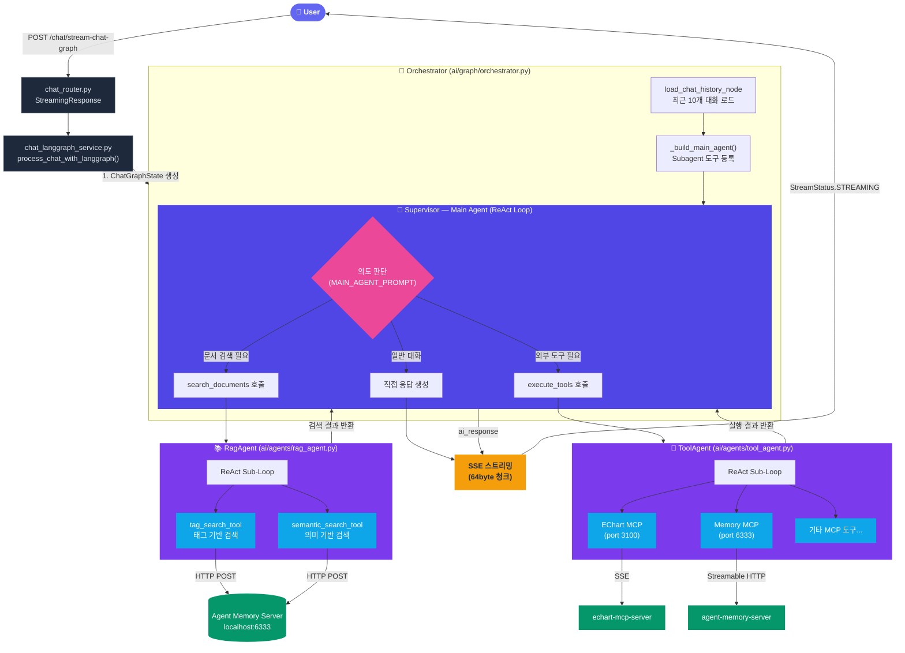
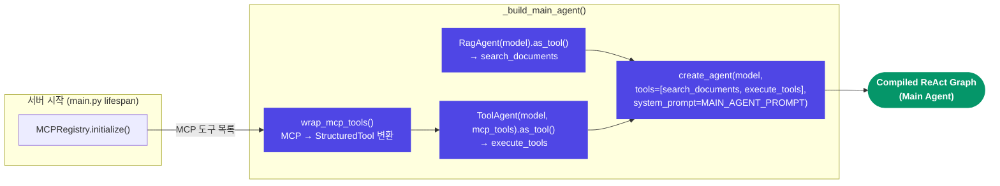

# AI 패키지 메시지 처리 아키텍처

사용자 메시지가 Supervisor(Main Agent)를 거쳐 Subagent 도구로 라우팅되는 흐름을 보여줍니다.

## 핵심 구조: 2단계 ReAct 에이전트 계층

| 계층 | 구성 요소 | 역할 |
|------|-----------|------|
| **Level 1** | Supervisor (Main Agent) | 사용자 의도 판단 → 적절한 Subagent 도구 호출 |
| **Level 2** | RagAgent / ToolAgent | 각각 독립된 ReAct 루프로 실제 작업 수행 |

## Subagent 도구 등록 흐름

## 요약

- **BaseAgent** ABC를 상속하여 `as_tool()`로 LangChain `@tool` 데코레이터를 씌우면, 완전한 ReAct 에이전트가 하나의 도구로 등록됨
- Main Agent는 `search_documents`, `execute_tools` 2개의 메타 도구만 인식
- 각 메타 도구 내부에서 실제 세부 도구(RAG 검색, MCP 호출)가 실행됨
