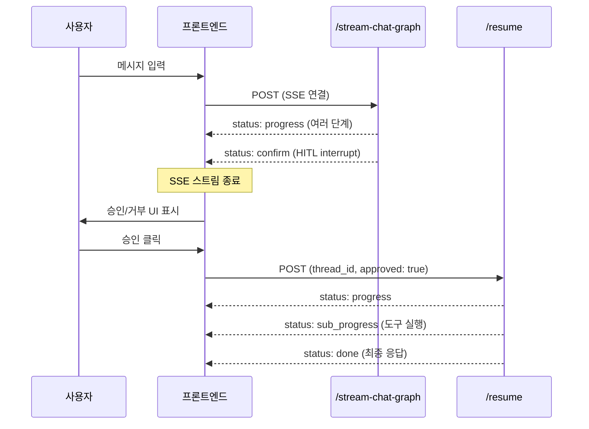

# API 레퍼런스

AI Chatbot Platform의 REST API 엔드포인트 명세입니다.

---

## 목차

- [공통 사항](#공통-사항)
- [Chat 엔드포인트](#chat-엔드포인트)
- [세션 관리 엔드포인트](#세션-관리-엔드포인트)
- [MCP 엔드포인트](#mcp-엔드포인트)
- [RAG 엔드포인트](#rag-엔드포인트)
- [SSE 이벤트 타입](#sse-이벤트-타입)
- [HITL 워크플로우](#hitl-워크플로우)

---

## 공통 사항

### 기본 URL

```
http://localhost:8000
```

### 응답 형식 (JSON 엔드포인트)

SSE가 아닌 일반 JSON 엔드포인트는 다음 공통 형식을 사용합니다:

```json
{
  "success": true,
  "message": "success",
  "data": { ... },
  "status_code": 200
}
```

에러 응답:

```json
{
  "success": false,
  "message": "에러 설명",
  "data": null,
  "status_code": 400
}
```

### SSE 엔드포인트

채팅 관련 엔드포인트(`/chat/stream-chat-graph`, `/chat/resume`)는 **Server-Sent Events** 스트림을 반환합니다. 각 이벤트는 `data:` 접두사를 가진 JSON 메시지입니다.

```
data: {"content":"...","status":"progress",...}

data: {"content":"...","status":"streaming",...}

data: {"content":"...","status":"done",...}
```

---

## Chat 엔드포인트

### POST /chat/stream-chat-graph

LangGraph 기반 메인 채팅 엔드포인트입니다. 오케스트레이터가 요청을 분석하여 적절한 서브에이전트에게 위임합니다.

**Content-Type**: `application/json`
**Response**: `text/event-stream` (SSE)

#### 요청 본문

| 필드 | 타입 | 필수 | 기본값 | 설명 |
|------|------|------|--------|------|
| `prompt` | `string` | O | - | 사용자 메시지 |
| `chat_session_id` | `int` | X | `null` | 채팅 세션 ID (기존 세션 이어가기) |
| `model` | `string` | X | `"gpt-5.1-mini"` | 사용할 LLM 모델 |
| `rag_tags` | `string[]` | X | `[]` | RAG 태그 범위 검색용 태그 목록 |

#### 요청 예시

```bash
curl -N -X POST http://localhost:8000/chat/stream-chat-graph \
  -H "Content-Type: application/json" \
  -d '{
    "prompt": "최근 24시간 불량률 상승 원인을 분석해줘",
    "chat_session_id": 1,
    "model": "gpt-4o",
    "rag_tags": []
  }'
```

#### SSE 응답 흐름

```
data: {"content":"📚 대화 기록을 불러오고 있습니다...","status":"progress"}

data: {"content":"🔧 전문가 에이전트를 준비하고 있습니다...","status":"progress"}

data: {"content":"🤖 생각 중입니다...","status":"progress"}

data: {"content":"🔍 팹 설비 분석 에이전트가 작업 중입니다...","status":"progress"}

data: {"content":"🔧 get_defect_summary 호출 중...","status":"sub_progress","agent_name":"fab_trace_agent","sub_tools":["get_defect_summary"],"parallel":false}

data: {"content":"✅ get_defect_summary 완료","status":"sub_progress","agent_name":"fab_trace_agent","sub_tools":["get_defect_summary"],"parallel":false}

data: {"content":"분석 결과입니다...","status":"streaming"}

data: {"content":"최종 응답 전문","status":"done"}
```

> **HITL 활성화 시**: `status: "confirm"` 이벤트가 발생할 수 있습니다. 이 경우 사용자 승인 후 `/chat/resume` 엔드포인트로 재개해야 합니다. 자세한 내용은 [HITL 워크플로우](#hitl-워크플로우) 섹션을 참고하세요.

---

### POST /chat/resume

HITL(Human-in-the-Loop) 재개 엔드포인트입니다. 도구 실행 승인/거부 후 중단된 그래프 실행을 재개합니다.

**Content-Type**: `application/json`
**Response**: `text/event-stream` (SSE)

#### 요청 본문

| 필드 | 타입 | 필수 | 기본값 | 설명 |
|------|------|------|--------|------|
| `thread_id` | `string` | O | - | HITL interrupt 시 받은 스레드 ID |
| `approved` | `bool` | O | - | 도구 실행 승인(`true`) / 거부(`false`) |
| `chat_session_id` | `int` | X | `null` | 채팅 세션 ID |
| `model` | `string` | X | `null` | 모델 (미지정 시 이전 요청 모델 사용) |

#### 요청 예시

```bash
# 승인
curl -N -X POST http://localhost:8000/chat/resume \
  -H "Content-Type: application/json" \
  -d '{
    "thread_id": "abc-123-def",
    "approved": true,
    "chat_session_id": 1
  }'

# 거부
curl -N -X POST http://localhost:8000/chat/resume \
  -H "Content-Type: application/json" \
  -d '{
    "thread_id": "abc-123-def",
    "approved": false,
    "chat_session_id": 1
  }'
```

#### 응답

승인 시 중단된 도구를 실행하고 결과를 스트리밍합니다. 거부 시 "사용자가 도구 실행을 거부했습니다" 메시지와 함께 대체 응답을 생성합니다.

---

### POST /chat/stream-chat

레거시 채팅 엔드포인트입니다. LangGraph 기반이 아닌 기존 방식으로 동작합니다.

> **참고**: 새로운 구현에서는 `/chat/stream-chat-graph` 사용을 권장합니다.

요청/응답 형식은 `/chat/stream-chat-graph`와 동일합니다.

---

## 세션 관리 엔드포인트

### GET /chat/session

모든 채팅 세션 목록을 조회합니다.

#### 요청 예시

```bash
curl http://localhost:8000/chat/session
```

#### 응답 예시

```json
{
  "success": true,
  "message": "success",
  "data": [
    {
      "chat_session_id": 1,
      "session_title": "불량률 분석",
      "created_at": "2025-01-15T09:00:00",
      "updated_at": "2025-01-15T09:30:00"
    },
    {
      "chat_session_id": 2,
      "session_title": "설비 상태 확인",
      "created_at": "2025-01-15T10:00:00",
      "updated_at": null
    }
  ],
  "status_code": 200
}
```

---

### GET /chat/message/{chat_session_id}

특정 세션의 메시지 목록을 조회합니다.

#### 경로 매개변수

| 매개변수 | 타입 | 설명 |
|---------|------|------|
| `chat_session_id` | `int` | 채팅 세션 ID |

#### 요청 예시

```bash
curl http://localhost:8000/chat/message/1
```

#### 응답 예시

```json
{
  "success": true,
  "message": "success",
  "data": [
    {
      "chat_message_id": 1,
      "role": "user",
      "content": "최근 불량률 현황을 알려줘",
      "created_at": "2025-01-15T09:00:00"
    },
    {
      "chat_message_id": 2,
      "role": "assistant",
      "content": "최근 24시간 불량률 현황입니다...",
      "created_at": "2025-01-15T09:00:05"
    }
  ],
  "status_code": 200
}
```

---

### GET /chat/model

사용 가능한 LLM 모델 목록을 조회합니다.

#### 요청 예시

```bash
curl http://localhost:8000/chat/model
```

#### 응답 예시

```json
{
  "success": true,
  "message": "success",
  "data": [
    {
      "provider": "openai",
      "model_name": "gpt-4o",
      "display_name": "GPT-4o"
    },
    {
      "provider": "gemini",
      "model_name": "gemini-2.0-flash",
      "display_name": "Gemini 2.0 Flash"
    }
  ],
  "status_code": 200
}
```

---

### DELETE /chat/session/{chat_session_id}

채팅 세션을 삭제합니다. 해당 세션의 모든 메시지도 함께 삭제됩니다.

#### 경로 매개변수

| 매개변수 | 타입 | 설명 |
|---------|------|------|
| `chat_session_id` | `int` | 삭제할 채팅 세션 ID |

#### 요청 예시

```bash
curl -X DELETE http://localhost:8000/chat/session/1
```

#### 응답 예시

```json
{
  "success": true,
  "message": "success",
  "data": null,
  "status_code": 200
}
```

---

### PATCH /chat/session/{chat_session_id}/title

채팅 세션의 제목을 변경합니다.

#### 경로 매개변수

| 매개변수 | 타입 | 설명 |
|---------|------|------|
| `chat_session_id` | `int` | 채팅 세션 ID |

#### 요청 본문

| 필드 | 타입 | 필수 | 설명 |
|------|------|------|------|
| `session_title` | `string` | O | 새로운 세션 제목 |

#### 요청 예시

```bash
curl -X PATCH http://localhost:8000/chat/session/1/title \
  -H "Content-Type: application/json" \
  -d '{"session_title": "불량 원인 분석 결과"}'
```

#### 응답 예시

```json
{
  "success": true,
  "message": "success",
  "data": {
    "chat_session_id": 1,
    "session_title": "불량 원인 분석 결과",
    "created_at": "2025-01-15T09:00:00",
    "updated_at": "2025-01-15T09:35:00"
  },
  "status_code": 200
}
```

---

## MCP 엔드포인트

### GET /mcp/tools

등록된 MCP 도구 목록을 조회합니다.

#### 쿼리 매개변수

| 매개변수 | 타입 | 기본값 | 범위 | 설명 |
|---------|------|--------|------|------|
| `limit` | `int` | `200` | 1-500 | 반환할 최대 도구 수 |

#### 요청 예시

```bash
curl "http://localhost:8000/mcp/tools?limit=50"
```

#### 응답 예시

```json
{
  "success": true,
  "message": "success",
  "data": [
    {
      "tool_name": "create_chart",
      "mcp_name": "echarts-server",
      "category": "visualization",
      "description": "ECharts 차트를 생성합니다",
      "recent_score": 10
    }
  ],
  "status_code": 200
}
```

---

## RAG 엔드포인트

### GET /rag/tags/tree

RAG 문서의 계층형 태그 트리를 조회합니다. Agent Memory 서버에서 데이터를 가져옵니다.

#### 요청 예시

```bash
curl http://localhost:8000/rag/tags/tree
```

#### 응답 예시

```json
{
  "success": true,
  "message": "success",
  "data": [
    {
      "tag": "engineering",
      "count": 15,
      "children": [
        {
          "tag": "engineering/process",
          "count": 8,
          "children": []
        }
      ]
    }
  ],
  "status_code": 200
}
```

---

## SSE 이벤트 타입

채팅 SSE 스트림에서 사용되는 이벤트 타입과 필드 상세 정보입니다.

### 이벤트 타입 (status 필드)

| status | 설명 | 발생 시점 |
|--------|------|----------|
| `progress` | 전체 진행 상황 | 오케스트레이터 각 단계 진입 시 |
| `sub_progress` | 서브에이전트 도구 진행 | 서브에이전트 내부 도구 호출/완료 시 |
| `streaming` | AI 응답 청크 | 최종 응답 스트리밍 시 |
| `done` | 완료 | 전체 응답 완료 시 |
| `error` | 오류 | 처리 중 오류 발생 시 |
| `confirm` | HITL 승인 요청 | 도구 실행 전 사용자 확인 필요 시 |

### 이벤트별 필드 상세

#### progress

```json
{
  "content": "🔍 팹 설비 분석 에이전트가 작업 중입니다...",
  "status": "progress"
}
```

| 필드 | 타입 | 설명 |
|------|------|------|
| `content` | `string` | 진행 상황 메시지 |
| `status` | `"progress"` | 이벤트 타입 |

#### sub_progress

```json
{
  "content": "🔧 get_defect_summary 호출 중...",
  "status": "sub_progress",
  "agent_name": "fab_trace_agent",
  "sub_tools": ["get_defect_summary"],
  "parallel": false
}
```

| 필드 | 타입 | 설명 |
|------|------|------|
| `content` | `string` | 도구 실행 상태 메시지 |
| `status` | `"sub_progress"` | 이벤트 타입 |
| `agent_name` | `string` | 서브에이전트 이름 |
| `sub_tools` | `string[]` | 호출 중인 도구 이름 목록 |
| `parallel` | `bool` | 병렬 호출 여부 (도구 2개 이상이면 `true`) |

#### streaming

```json
{
  "content": "분석 결과 텍스트...",
  "status": "streaming"
}
```

#### done

```json
{
  "content": "전체 최종 응답 텍스트",
  "status": "done"
}
```

#### error

```json
{
  "content": "에러 메시지",
  "status": "error",
  "error": "상세 에러 내용"
}
```

#### confirm (HITL)

```json
{
  "content": "'search_documents' 도구를 실행하시겠습니까?",
  "status": "confirm",
  "thread_id": "abc-123-def",
  "tool_name": "search_documents",
  "tool_args": {
    "query": "검색어"
  }
}
```

| 필드 | 타입 | 설명 |
|------|------|------|
| `content` | `string` | 승인 요청 메시지 |
| `status` | `"confirm"` | HITL 확인 이벤트 |
| `thread_id` | `string` | 재개 시 사용할 스레드 ID |
| `tool_name` | `string` | 실행 대기 중인 도구 이름 |
| `tool_args` | `object` | 도구에 전달될 인자 |

---

## HITL 워크플로우

Human-in-the-Loop (HITL)는 특정 도구 실행 전 사용자 승인을 받는 메커니즘입니다.

### 대상 도구

현재 HITL이 활성화된 도구:

| 도구 이름 | 서브에이전트 | 설명 |
|-----------|-------------|------|
| `search_documents` | RagAgent | 문서 검색 |
| `analyze_fab_trace` | FabTraceAgent | 팹 설비 분석 |

### 전체 흐름



### 단계별 설명

1. **요청 전송**: 프론트엔드가 `/chat/stream-chat-graph`로 SSE 요청
2. **오케스트레이터 처리**: 에이전트가 요청을 분석하고 도구 호출 결정
3. **HITL Interrupt**: HITL 대상 도구 호출 시 `confirm` 이벤트 발생, SSE 스트림 종료
4. **사용자 결정**: 프론트엔드에서 승인/거부 UI 표시
5. **재개 요청**: 사용자 결정을 `/chat/resume`으로 전송
6. **실행 재개**: 승인 시 도구 실행 후 결과 스트리밍, 거부 시 대체 응답 생성

### 프론트엔드 구현 가이드

```javascript
// 1. SSE 연결 및 이벤트 처리
const eventSource = new EventSource('/chat/stream-chat-graph', {
  method: 'POST',
  body: JSON.stringify({ prompt: '...', chat_session_id: 1 })
});

eventSource.onmessage = (event) => {
  const data = JSON.parse(event.data);

  switch (data.status) {
    case 'progress':
      // 진행 상황 표시
      showProgress(data.content);
      break;

    case 'sub_progress':
      // 서브에이전트 도구 진행 표시
      showSubProgress(data.agent_name, data.sub_tools, data.parallel);
      break;

    case 'confirm':
      // HITL 승인 UI 표시
      showConfirmDialog(data.thread_id, data.tool_name, data.tool_args);
      break;

    case 'done':
      // 최종 응답 표시
      showResponse(data.content);
      break;

    case 'error':
      showError(data.error);
      break;
  }
};

// 2. HITL 승인 후 재개
async function resumeChat(threadId, approved) {
  const response = await fetch('/chat/resume', {
    method: 'POST',
    headers: { 'Content-Type': 'application/json' },
    body: JSON.stringify({
      thread_id: threadId,
      approved: approved,
      chat_session_id: currentSessionId
    })
  });
  // SSE 스트림으로 응답 수신
}
```

### 연쇄 HITL

하나의 요청에서 여러 HITL 대상 도구가 호출될 수 있습니다. 이 경우 `/chat/resume`의 응답에서도 `confirm` 이벤트가 다시 발생할 수 있으므로, 프론트엔드는 resume 응답에서도 `confirm` 상태를 처리할 수 있어야 합니다.

```
요청 -> confirm (search_documents) -> 승인 -> resume
     -> confirm (analyze_fab_trace) -> 승인 -> resume
     -> done (최종 응답)
```
