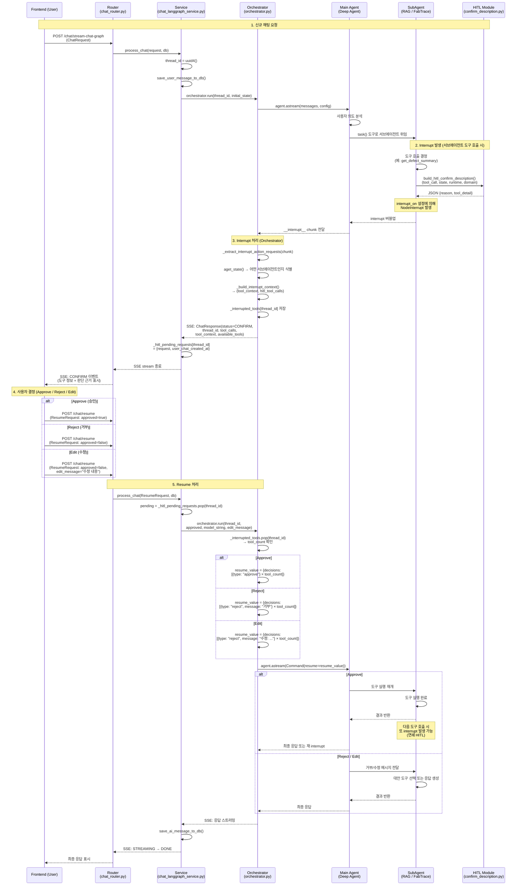
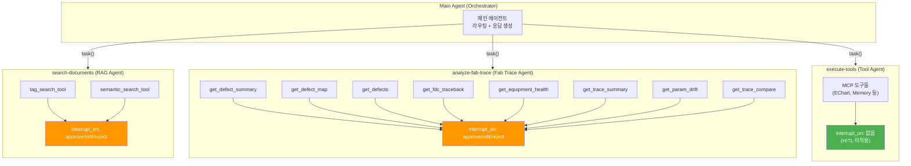
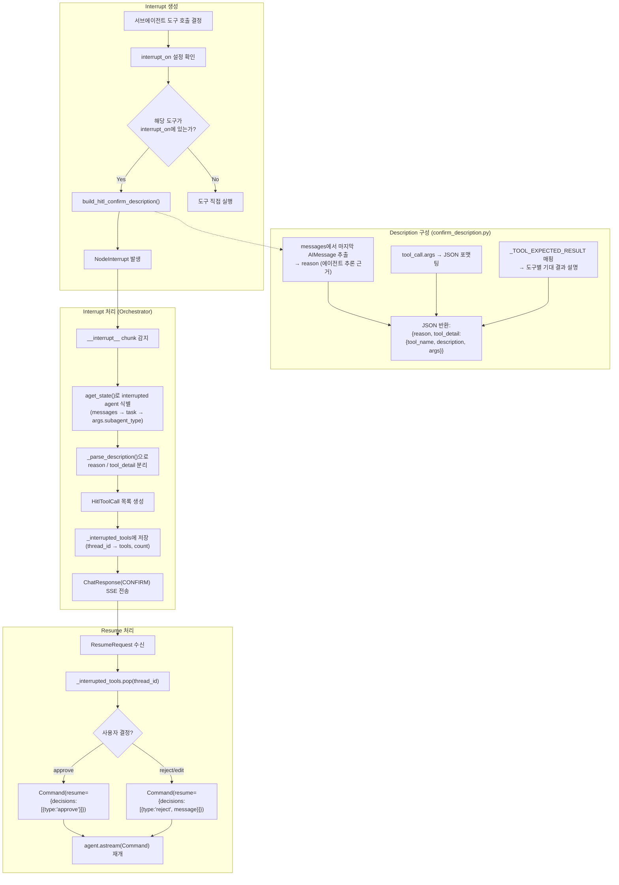
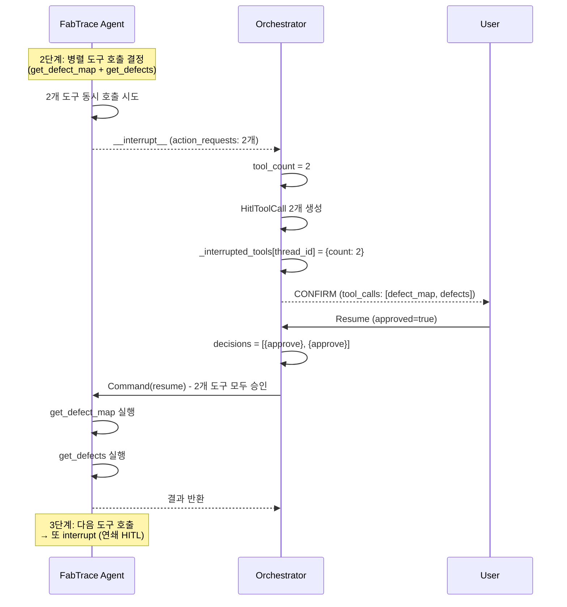

# HITL (Human-in-the-Loop) Interrupt Flow

## 전체 흐름 다이어그램

```mermaid
sequenceDiagram
    participant U as Frontend (User)
    participant R as Router<br/>(chat_router.py)
    participant S as Service<br/>(chat_langgraph_service.py)
    participant O as Orchestrator<br/>(orchestrator.py)
    participant M as Main Agent<br/>(Deep Agent)
    participant SA as SubAgent<br/>(RAG / FabTrace)
    participant H as HITL Module<br/>(confirm_description.py)

    Note over U,H: 1. 신규 채팅 요청

    U->>R: POST /chat/stream-chat-graph<br/>(ChatRequest)
    R->>S: process_chat(request, db)
    S->>S: thread_id = uuid4()
    S->>S: save_user_message_to_db()
    S->>O: orchestrator.run(thread_id, initial_state)

    O->>M: agent.astream(messages, config)
    M->>M: 사용자 의도 분석
    M->>SA: task() 도구로 서브에이전트 위임

    Note over SA,H: 2. Interrupt 발생 (서브에이전트 도구 호출 시)

    SA->>SA: 도구 호출 결정<br/>(예: get_defect_summary)
    SA->>H: build_hitl_confirm_description()<br/>(tool_call, state, runtime, domain)
    H-->>SA: JSON {reason, tool_detail}

    Note over SA: interrupt_on 설정에 의해<br/>NodeInterrupt 발생

    SA-->>M: interrupt 버블업
    M-->>O: __interrupt__ chunk 전달

    Note over O: 3. Interrupt 처리 (Orchestrator)

    O->>O: _extract_interrupt_action_requests(chunk)
    O->>O: aget_state() → 어떤 서브에이전트인지 식별
    O->>O: _build_interrupt_context()<br/>→ (tool_context, hitl_tool_calls)
    O->>O: _interrupted_tools[thread_id] 저장

    O-->>S: SSE: ChatResponse(status=CONFIRM,<br/>thread_id, tool_calls,<br/>tool_context, available_tools)

    S->>S: _hitl_pending_requests[thread_id]<br/>= {request, user_chat_created_at}
    S-->>R: SSE stream 종료
    R-->>U: SSE: CONFIRM 이벤트<br/>(도구 정보 + 판단 근거 표시)

    Note over U: 4. 사용자 결정 (Approve / Reject / Edit)

    alt Approve (승인)
        U->>R: POST /chat/resume<br/>(ResumeRequest: approved=true)
    else Reject (거부)
        U->>R: POST /chat/resume<br/>(ResumeRequest: approved=false)
    else Edit (수정)
        U->>R: POST /chat/resume<br/>(ResumeRequest: approved=false,<br/>edit_message="수정 내용")
    end

    Note over R,O: 5. Resume 처리

    R->>S: process_chat(ResumeRequest, db)
    S->>S: pending = _hitl_pending_requests.pop(thread_id)
    S->>O: orchestrator.run(thread_id,<br/>approved, model_string, edit_message)

    O->>O: _interrupted_tools.pop(thread_id)<br/>→ tool_count 확인

    alt Approve
        O->>O: resume_value = {decisions:<br/>[{type: "approve"} × tool_count]}
    else Reject
        O->>O: resume_value = {decisions:<br/>[{type: "reject", message: "거부"} × tool_count]}
    else Edit
        O->>O: resume_value = {decisions:<br/>[{type: "reject", message: "수정: ..."} × tool_count]}
    end

    O->>M: agent.astream(Command(resume=resume_value))

    alt Approve
        M->>SA: 도구 실행 재개
        SA->>SA: 도구 실행 완료
        SA-->>M: 결과 반환

        Note over SA: 다음 도구 호출 시<br/>또 interrupt 발생 가능<br/>(연쇄 HITL)

        M-->>O: 최종 응답 또는 재 interrupt
    else Reject / Edit
        M->>SA: 거부/수정 메시지 전달
        SA->>SA: 대안 도구 선택 또는 응답 생성
        SA-->>M: 결과 반환
        M-->>O: 최종 응답
    end

    O-->>S: SSE: 응답 스트리밍
    S->>S: save_ai_message_to_db()
    S-->>R: SSE: STREAMING → DONE
    R-->>U: 최종 응답 표시
```

## 서브에이전트별 Interrupt 설정

```mermaid
graph TD
    subgraph MainAgent["Main Agent (Orchestrator)"]
        direction TB
        MA[메인 에이전트<br/>라우팅 + 응답 생성]
    end

    subgraph RAG["search-documents (RAG Agent)"]
        direction TB
        RA_T1["tag_search_tool"]
        RA_T2["semantic_search_tool"]
        RA_INT["interrupt_on: approve/edit/reject"]
        RA_T1 --> RA_INT
        RA_T2 --> RA_INT
    end

    subgraph FAB["analyze-fab-trace (Fab Trace Agent)"]
        direction TB
        FA_T1["get_defect_summary"]
        FA_T2["get_defect_map"]
        FA_T3["get_defects"]
        FA_T4["get_fdc_traceback"]
        FA_T5["get_equipment_health"]
        FA_T6["get_trace_summary"]
        FA_T7["get_param_drift"]
        FA_T8["get_trace_compare"]
        FA_INT["interrupt_on: approve/edit/reject"]
        FA_T1 --> FA_INT
        FA_T2 --> FA_INT
        FA_T3 --> FA_INT
        FA_T4 --> FA_INT
        FA_T5 --> FA_INT
        FA_T6 --> FA_INT
        FA_T7 --> FA_INT
        FA_T8 --> FA_INT
    end

    subgraph MCP["execute-tools (Tool Agent)"]
        direction TB
        MCP_T["MCP 도구들<br/>(EChart, Memory 등)"]
        MCP_NO["interrupt_on: 없음<br/>(HITL 미적용)"]
        MCP_T --> MCP_NO
    end

    MA -->|"task()"| RAG
    MA -->|"task()"| FAB
    MA -->|"task()"| MCP

    style RA_INT fill:#ff9800,color:#fff
    style FA_INT fill:#ff9800,color:#fff
    style MCP_NO fill:#4caf50,color:#fff
```

## 데이터 흐름 상세

```mermaid
flowchart TD
    subgraph InterruptGeneration["Interrupt 생성"]
        A1["서브에이전트 도구 호출 결정"]
        A2["interrupt_on 설정 확인"]
        A3{"해당 도구가<br/>interrupt_on에 있는가?"}
        A4["build_hitl_confirm_description()"]
        A5["NodeInterrupt 발생"]
        A6["도구 직접 실행"]

        A1 --> A2 --> A3
        A3 -->|Yes| A4 --> A5
        A3 -->|No| A6
    end

    subgraph DescriptionBuild["Description 구성 (confirm_description.py)"]
        B1["messages에서 마지막 AIMessage 추출<br/>→ reason (에이전트 추론 근거)"]
        B2["tool_call.args → JSON 포맷팅"]
        B3["_TOOL_EXPECTED_RESULT 매핑<br/>→ 도구별 기대 결과 설명"]
        B4["JSON 반환:<br/>{reason, tool_detail:{tool_name, description, args}}"]

        B1 --> B4
        B2 --> B4
        B3 --> B4
    end

    subgraph InterruptHandling["Interrupt 처리 (Orchestrator)"]
        C1["__interrupt__ chunk 감지"]
        C2["aget_state()로 interrupted agent 식별<br/>(messages → task → args.subagent_type)"]
        C3["_parse_description()으로<br/>reason / tool_detail 분리"]
        C4["HitlToolCall 목록 생성"]
        C5["_interrupted_tools에 저장<br/>(thread_id → tools, count)"]
        C6["ChatResponse(CONFIRM) SSE 전송"]

        C1 --> C2 --> C3 --> C4 --> C5 --> C6
    end

    subgraph ResumeHandling["Resume 처리"]
        D1["ResumeRequest 수신"]
        D2["_interrupted_tools.pop(thread_id)"]
        D3{"사용자 결정?"}
        D4["Command(resume={decisions:<br/>[{type:'approve'}]})"]
        D5["Command(resume={decisions:<br/>[{type:'reject', message}]})"]
        D6["agent.astream(Command) 재개"]

        D1 --> D2 --> D3
        D3 -->|approve| D4 --> D6
        D3 -->|reject/edit| D5 --> D6
    end

    A5 --> C1
    A4 -.-> B1
    C6 --> D1
```

## 병렬 도구 호출 시 Interrupt

```mermaid
sequenceDiagram
    participant SA as FabTrace Agent
    participant O as Orchestrator
    participant U as User

    Note over SA: 2단계: 병렬 도구 호출 결정<br/>(get_defect_map + get_defects)

    SA->>SA: 2개 도구 동시 호출 시도
    SA-->>O: __interrupt__ (action_requests: 2개)

    O->>O: tool_count = 2
    O->>O: HitlToolCall 2개 생성
    O->>O: _interrupted_tools[thread_id] = {count: 2}
    O-->>U: CONFIRM (tool_calls: [defect_map, defects])

    U->>O: Resume (approved=true)
    O->>O: decisions = [{approve}, {approve}]
    O->>SA: Command(resume) - 2개 도구 모두 승인
    SA->>SA: get_defect_map 실행
    SA->>SA: get_defects 실행
    SA-->>O: 결과 반환

    Note over SA: 3단계: 다음 도구 호출<br/>→ 또 interrupt (연쇄 HITL)
```
